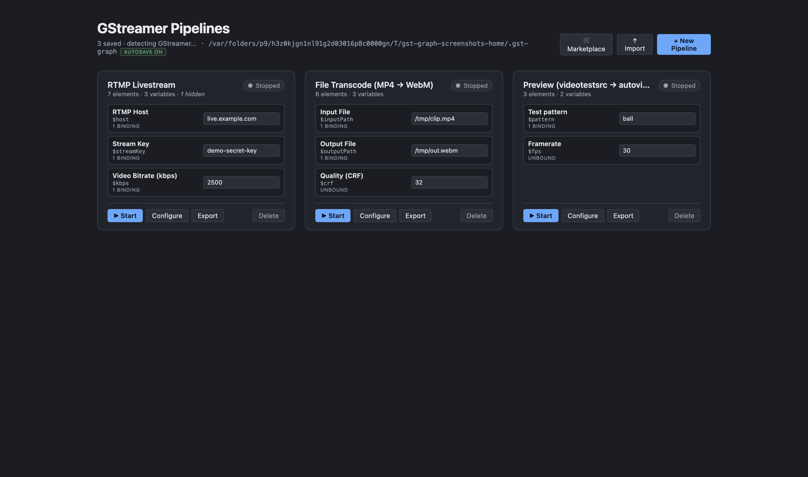
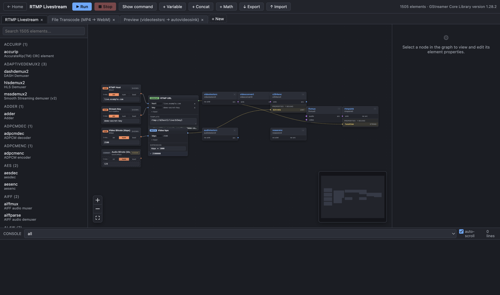
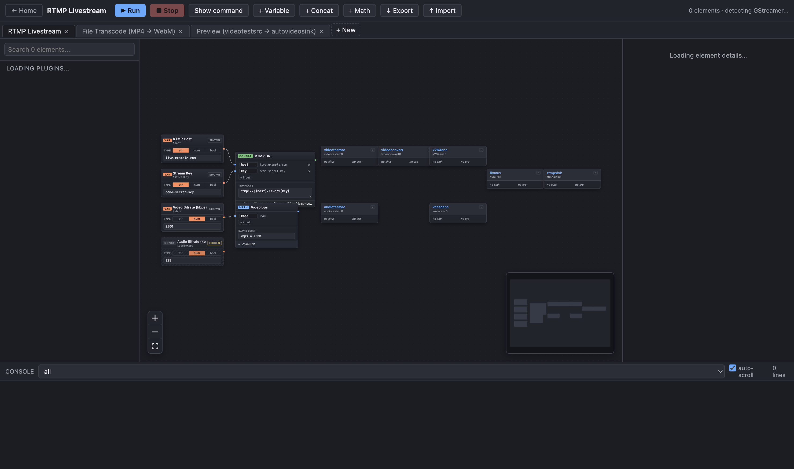
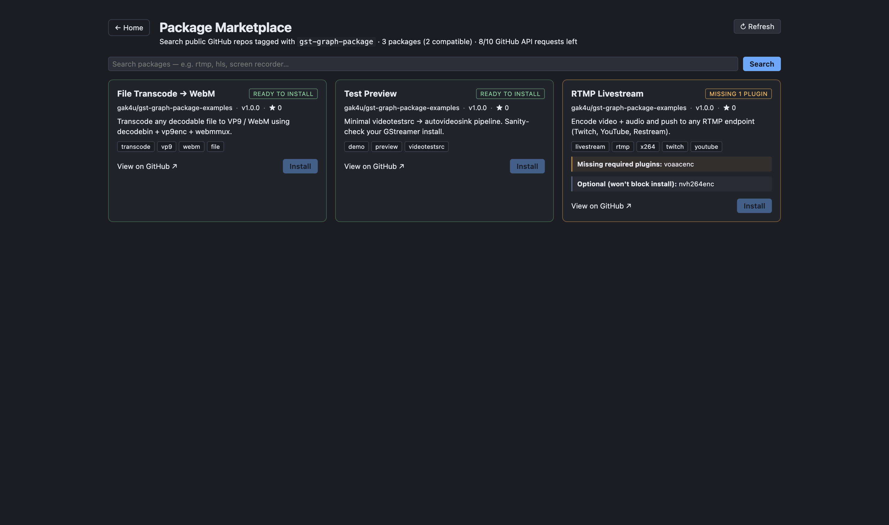

# gst-graph

A desktop visual editor for GStreamer pipelines. Drag elements from a
plugin-aware palette, wire them together with caps-validated stream
links, bind variables and computed transforms to element properties,
and run the resulting `gst-launch-1.0` pipeline directly from the app.

Includes an MCP (Model Context Protocol) server so a local LLM agent
can read, edit, and run pipelines on your machine using the same data
files the UI uses, with live two-way sync.

## Screenshots

Home screen — pipelines as tiles with variable controls, status, and
start/stop/configure/export actions:



Editor — plugin-aware palette, the xyflow graph canvas with variable
/ transform / element nodes, minimap, and the console pane at the
bottom:



Inspector — every element exposes its properties grouped by category,
with the right widget per kind (booleans, enums, ranges, fractions,
strings), conditional-property visibility (e.g. `pattern=ball` reveals
the relevant fields), pad templates and caps, and a property search:



Marketplace — browse public GitHub repos tagged `gst-graph-package`,
see at a glance whether your local GStreamer install has the plugins a
package needs, and install with one click. Compatibility is checked
against your `gst-inspect-1.0` plugin cache and any GStreamer version
range declared by the package.



## Features

- **Plugin-aware palette.** The app shells out to `gst-inspect-1.0` on
  first run, parses every element on your system (properties, pad
  templates, caps, conditional properties, enums, ranges) and caches
  the result on disk. Search by name, longname, or description.
- **Caps-validated stream links.** Dragging from a source pad to a
  sink pad refuses to connect when the caps are incompatible.
- **Property editors per kind.** Booleans, enums, ranges, fractions,
  strings, integers — each gets the right widget with default value,
  blurb, and visibility based on conditional requirements (e.g. an
  RTMP element's `tcUrl` only appears when `auth-method` requires it).
- **Multiple pipelines.** Home screen lists every saved pipeline as a
  tile with a status pill, exposed variables, and Start / Stop /
  Configure / Export / Delete actions. Each tile becomes its own
  editor when opened. The editor focuses on one pipeline at a time —
  use `← Home` to leave the editor without deleting anything.
- **New pipeline chooser.** `+ New Pipeline` opens a small modal: pick
  **Blank pipeline** to start empty, or pick any pipeline from an
  installed marketplace package as a one-click template. Templates
  clone with fresh node/edge IDs, so editing the new copy never
  touches the source. If a package's pipelines were deleted but the
  install record remains, the chooser offers to re-fetch the package
  from GitHub.
- **Variables.** Add a `string` / `number` / `boolean` variable, wire
  its output handle to any element property, and the property's value
  is overridden at runtime. The variable's kind is auto-inferred from
  the property it is first bound to. Human labels are shown on the
  Home tile next to the editable value.
- **Internal constants.** Toggle a variable to `hidden` and it
  disappears from the Home screen but keeps driving the bound
  properties — useful for things you want to bake in but not expose to
  end users.
- **Transforms.**
  - `Concat`: template-style string concatenation with `${name}`
    placeholders (good for URLs, file paths, etc.)
  - `Math`: sandboxed arithmetic expressions over named inputs, with
    `Math.*` available (`a * 1000`, `Math.min(a, b)`, ...).
  - Live `=` preview shows the resolved value as you type. Transforms
    can feed into other transforms, with cycle detection.
- **Loopable groups.** Select two or more element nodes, click
  **⤓ Group selected**, and they collapse into one container that
  represents the prototype branch. Bind a list-typed variable as the
  group's iterator and pick which member properties vary per iteration
  (e.g. `rtmp2sink.location` becomes a 3-element list). At runtime the
  builder unrolls the group into N copies with fresh instance names —
  one canvas branch fans out to N gst-launch branches, with upstream
  tees auto-allocating fresh request pads per copy. The container shows
  a `× N` badge matching the iterator length and surfaces an error if
  the iterator is missing, scalar, or empty.
- **Persistence under `~/.gst-graph/`.**
  - `pipelines.json` — every change is autosaved (atomic temp+rename
    write with a `.bak` rotation kept around for one-revision
    rollback).
  - `plugin-cache.json` — element catalog, refreshed when the
    GStreamer version changes.
  - `runs.json` — cross-process registry of running pipelines.
  - `mcp-http.json` — port info for the embedded MCP HTTP server when
    the app is running.
  - All writes are atomic, persistence is gated on a successful load
    (a corrupt file won't be overwritten by an empty in-memory state),
    and pending writes are flushed on quit.
- **Importable / exportable JSON.** Pipelines can be exported as JSON
  from the Home tile or the editor toolbar, and reimported in any
  install (multi-file picker supported).
- **MCP server (stdio + HTTP).** Drive the app from any
  MCP-compatible LLM client. 22 tools covering discovery, full graph
  editing, transforms, variables, and runtime control. The Electron UI
  watches the data files and reloads live when the agent makes
  changes.
- **Package marketplace.** Any public GitHub repo tagged with the
  topic `gst-graph-package` becomes discoverable. A repo can ship a
  single package at its root, or multiple under `packages/<id>/`.
  The app checks each package's required GStreamer elements against
  your locally installed plugin set before letting you install. A
  preview modal shows exactly which pipelines and variable defaults
  will be added, flags any suspicious element names, and pins to a
  commit SHA. Curated, ready-to-install packages live at
  [gak4u/gst-graph-packages](https://github.com/gak4u/gst-graph-packages);
  schema docs + small examples at
  [gak4u/gst-graph-package-examples](https://github.com/gak4u/gst-graph-package-examples).
- **First-run GStreamer check.** If `gst-inspect-1.0` isn't on the
  expected paths, the app shows a setup screen with platform-aware
  install commands (Homebrew, apt/dnf/pacman, choco/installer) and a
  recheck button — no terminal jumping required.
- **Higher API limits via `gh`.** If the GitHub CLI is installed and
  authenticated (`gh auth login`), the marketplace transparently uses
  your token, bumping the GitHub search bucket from 10/min to 30/min
  and core from 60/hr to 5000/hr. No token entry, no keychain prompt.

## Requirements

- macOS, Linux, or Windows
- [GStreamer 1.x](https://gstreamer.freedesktop.org/) with
  `gst-inspect-1.0` and `gst-launch-1.0` on `PATH`. Verify with
  `gst-inspect-1.0 --gst-version`.
- Node.js 20+ (24+ recommended)
- npm 10+

### Installing GStreamer

- **macOS (Homebrew):** `brew install gstreamer gst-plugins-base
  gst-plugins-good gst-plugins-bad gst-plugins-ugly gst-libav`
- **Debian / Ubuntu:** `sudo apt install gstreamer1.0-tools
  gstreamer1.0-plugins-base gstreamer1.0-plugins-good
  gstreamer1.0-plugins-bad gstreamer1.0-plugins-ugly
  gstreamer1.0-libav`
- **Windows:** install the official GStreamer development +
  runtime MSIs from gstreamer.freedesktop.org and add the `bin/`
  directory to `PATH`.

## Installation

```sh
git clone <this-repository-url> gst-graph
cd gst-graph
npm install
```

## Running in development

```sh
npm run dev
```

This starts three concurrent processes:

- Vite dev server (renderer) on `http://localhost:5173`
- TypeScript compiler in watch mode for the Electron main and
  preload scripts
- Electron, pointed at the dev server with hot reload

If you change a file under `electron/` or `mcp/` while Electron is
already running, the build is recompiled but the running process is
**not** automatically restarted — quit Electron with ⌘Q and re-run
`npm run dev` to pick up main-process changes.

## Building a production bundle

```sh
npm run build
npm start
```

`npm run build` produces `dist/` (renderer bundle) and
`dist-electron/` (compiled main, preload, and MCP server). `npm
start` launches Electron against the built bundle.

## Using the editor

### 1. Create a pipeline

On the Home screen click `+ New Pipeline`. A chooser opens:

- **Blank pipeline** — starts from an empty canvas.
- **Start from an installed package** — lists every pipeline shipped
  by your installed marketplace packages. Pick one to clone it with
  fresh IDs. Packages whose pipelines have since been deleted offer a
  "re-fetch" option that re-installs from the pinned SHA.

The editor opens with the new pipeline. Use `← Home` in the toolbar
to leave the editor at any time — that's not a delete; the pipeline
stays on the Home screen.

### 2. Add elements

The left palette lists every element discovered by `gst-inspect-1.0`.
Type in the search box to filter. Drag elements onto the canvas.

### 3. Wire elements together

Drag from a source pad handle (right side of a node) to a sink pad
handle (left side of another node). The drag preview rejects
incompatible caps before you release.

### 4. Edit properties

Click a node to open the right-hand inspector. Properties are grouped
by category, with conditional properties hidden until their
requirements are met. Use the search box at the top of the inspector
to jump to a specific property.

### 5. Add variables (optional)

Click `+ Variable` in the toolbar. Drag from the variable's `out`
handle to any element property. The variable's value (settable from
the Home tile or the inspector) overrides the static property at
runtime. Use the `shown` / `hidden` chip on the variable node to flip
it between a Home-screen-exposed variable and an internal constant.

### 6. Add transforms (optional)

Click `+ Concat` or `+ Math` in the toolbar. Each transform has
named input slots, an editable expression / template, and a live `=`
preview of the resolved value. Wire variables (or other transforms)
into the input slots, then wire the transform's output to an element
property.

Examples:

- `Concat` template `rtmp://${host}/live/${streamKey}` with `host`
  and `streamKey` variables → produces a fully composed URL bound to
  an `rtmpsink`'s `location`.
- `Math` expression `kbps * 1000` with `kbps` variable → bound to
  `num-buffers` or any bitrate property.

### 7. Run

Click `▶ Start` in the toolbar (or on the Home tile). The pipeline is
spawned as `gst-launch-1.0 -e -v <command>` and its output streams
into the bottom console. Click `■ Stop` to send SIGINT.

### 8. Export / Import

`↓ Export` from the toolbar or a Home tile saves the pipeline as JSON
(no GStreamer-specific tokenization — just the graph). `↑ Import`
accepts one or more JSON files and adds them with name de-duplication.

## File layout

All state lives under `~/.gst-graph/`:

```
~/.gst-graph/
├── pipelines.json           # your saved pipelines (atomic writes + .bak rotation)
├── pipelines.json.bak       # previous revision, kept for recovery
├── plugin-cache.json        # cached gst-inspect output (refreshed on version change)
├── packages.json            # install records (repo, packageId, pinned SHA, pipelineIds)
├── packages.json.bak        # previous revision of the install record
├── marketplace-cache.json   # search result cache (TTL 1h, keyed by query + auth state)
├── runs.json                # PIDs and metadata of currently-running pipelines
└── mcp-http.json            # MCP HTTP server URL and port (only while Electron is running)
```

The data directory and version are visible in the Home meta line, along
with an `autosave on` / `autosave OFF` indicator. If autosave goes OFF
(unreadable `pipelines.json`), the file is left alone instead of being
overwritten with an empty state — back it up from `.bak` if needed and
then restart the app.

## Package marketplace

Open the **🛒 Marketplace** button on the Home screen. The app calls the
GitHub Search API for public repos tagged with the topic
`gst-graph-package`, fetches each package's manifest, and renders cards
with a compatibility pill that compares the package's required elements
against your locally cached `gst-inspect-1.0` plugin set.

Clicking **Install…** opens a preview modal that lists every pipeline
that will be added (with element / variable counts), every variable
default that will be applied, any plugins still missing on your
machine, and the pinned commit SHA. The install records the package in
`~/.gst-graph/packages.json` so it later shows up in the "+ New
Pipeline" chooser as a template.

Search results are cached in `~/.gst-graph/marketplace-cache.json` for
an hour, keyed by query + auth state. Cached results never display a
stale rate-limit number — click **↻ Refresh** for a live fetch.

### GitHub API limits

Unauthenticated GitHub requests are tight: 10 search calls per minute,
60 core calls per hour. If the GitHub CLI is installed and authenticated
(`gh auth login`), the app uses your existing OAuth token transparently
— no token entry, no keychain prompt — and limits jump to 30 search /min
and 5000 core/hr. The meta line in the marketplace header tells you
which state you're in (`auth: gh` vs `anonymous`).

### Publishing a package

A package is just a public GitHub repo with the topic
`gst-graph-package` and a `gst-package.json` manifest. The repo can host
a single package at the root or multiple packages under
`packages/<id>/`:

```
my-package-repo/                           topic: gst-graph-package
├── gst-package.json                       # single-package layout
├── README.md
└── pipelines/
    └── livestream.json
```

Or multi-package:

```
my-packages-repo/
├── gst-index.json                         # optional, avoids directory walk
├── README.md
└── packages/
    ├── rtmp-livestream/
    │   ├── gst-package.json
    │   └── pipelines/livestream.json
    └── file-transcode/
        ├── gst-package.json
        └── pipelines/transcode.json
```

Minimal `gst-package.json`:

```json
{
  "schemaVersion": 1,
  "id": "rtmp-livestream",
  "name": "RTMP Livestream",
  "version": "1.0.0",
  "summary": "Encode video + audio and push to any RTMP endpoint.",
  "author": { "name": "you", "url": "https://github.com/you" },
  "tags": ["livestream", "rtmp"],
  "license": "PolyForm-NC-1.0",
  "requires": {
    "gstreamer": ">=1.18",
    "elements": ["videotestsrc", "x264enc", "flvmux", "rtmpsink"]
  },
  "pipelines": [{ "file": "pipelines/livestream.json", "name": "RTMP Livestream" }],
  "variables": [
    { "varName": "host", "label": "RTMP Host", "default": "live.twitch.tv/app" },
    { "varName": "streamKey", "label": "Stream Key", "secret": true }
  ]
}
```

The pipeline JSON files inside the package use exactly the same format
the app exports today, so the easiest way to author a package is: build
the pipeline in the editor, click `↓ Export`, drop the JSON into a
`pipelines/` folder, and write the manifest.

- [gak4u/gst-graph-packages](https://github.com/gak4u/gst-graph-packages)
  — curated, ready-to-install collection (RTMP livestream, per-platform
  webcam preview and screen recording).
- [gak4u/gst-graph-package-examples](https://github.com/gak4u/gst-graph-package-examples)
  — small reference examples plus schema docs for authoring your own.

## MCP integration

`mcp/README.md` covers the full tool catalog and client configuration
in depth. Quick start:

### Build

```sh
npm run mcp:build
```

This produces `dist-electron/mcp/stdio.js` (and is included in the
regular `npm run build`).

### Configure your client

The server speaks the standard Model Context Protocol over stdio (for
subprocess-style clients) and over HTTP/SSE (embedded in Electron when
the app is running, port discoverable in `~/.gst-graph/mcp-http.json`).

For Claude Desktop, edit
`~/Library/Application Support/Claude/claude_desktop_config.json` on
macOS and add:

```json
{
  "mcpServers": {
    "gst-graph": {
      "command": "node",
      "args": ["/absolute/path/to/gst-graph/dist-electron/mcp/stdio.js"]
    }
  }
}
```

For the Factory droid CLI:

```sh
droid mcp add gst-graph node /absolute/path/to/gst-graph/dist-electron/mcp/stdio.js --type stdio
```

Restart your MCP client. You should see 22 `gst_*` tools available.

### Verify

```sh
npm run mcp:smoke        # exercises stdio transport end-to-end
npm run mcp:smoke:http   # boots HTTP transport and hits /healthz + /sse
```

### Live sync

When the MCP server writes to `pipelines.json` (atomic with `.bak`
rotation), the running Electron app picks up the change within a
debounce window and reloads, preserving the active selection and
console log buffer. Runs are tracked in `runs.json`, so a pipeline
started by the agent can be stopped from the UI and vice versa.

## Available scripts

| Script               | Description                                            |
| -------------------- | ------------------------------------------------------ |
| `npm run dev`        | Renderer + main TS watcher + Electron with hot reload  |
| `npm run build`      | Production renderer bundle plus compiled main / MCP    |
| `npm start`          | Run the built Electron app                             |
| `npm run typecheck`  | TypeScript noEmit for both projects                    |
| `npm run lint`       | ESLint                                                 |
| `npm run mcp`        | Run the MCP server on stdio                            |
| `npm run mcp:build`  | Compile only the MCP/Electron Node side                |
| `npm run mcp:smoke`  | Spawn the stdio MCP server and run an integration test |
| `npm run mcp:smoke:http` | Boot the HTTP MCP server and check it                |
| `npm run test:marketplace` | Unit tests for manifest parsing, compat checks, install transformer |
| `npm run screenshots` | Rebuild and capture the README screenshots (uses a sandboxed temp HOME) |

## Architecture

```
┌──────────────────────────┐      ┌─────────────────────────────┐
│       Electron Main      │      │       MCP Server (stdio)    │
│  - IPC handlers          │      │  - Same tool catalog        │
│  - gst-inspect cache     │◀────▶│  - Spawned by Claude /      │
│  - Runner (gst-launch)   │      │    Cursor / Factory         │
│  - File watch + autosave │      │  - Reads/writes same files  │
│  - HTTP MCP server (SSE) │      └─────────────────────────────┘
└──────────────────────────┘                  │
              │                               │
              │ IPC                           │ atomic file writes
              │                               │
              ▼                               ▼
┌──────────────────────────┐      ┌─────────────────────────────┐
│   React renderer (Vite)  │      │     ~/.gst-graph/           │
│  - xyflow graph editor   │◀────▶│   pipelines.json + .bak     │
│  - Zustand store         │      │   plugin-cache.json         │
│  - HomeScreen / Inspector│      │   packages.json + .bak      │
│  - Marketplace + Setup   │      │   marketplace-cache.json    │
│  - Live reload on extern │      │   runs.json · mcp-http.json │
└──────────────────────────┘      └─────────────────────────────┘
```

The Electron main process and the standalone MCP stdio server both
operate against the same files in `~/.gst-graph/`. Atomic writes plus
file-watching in the main process provide live two-way sync. The
runner registry (`runs.json`) plus the Electron runner's
`process.kill` fallback let the UI stop pipelines started by the MCP
server and vice versa.

## Project layout

```
gst-graph/
├── electron/                 # Electron main and preload
│   ├── main.ts               # IPC, persistence, file watcher, HTTP MCP server
│   ├── preload.ts            # contextBridge surface
│   ├── gst/
│   │   ├── inspect.ts        # gst-inspect-1.0 parser, plugin cache
│   │   ├── setup.ts          # GStreamer install detection + install hints
│   │   └── runner.ts         # builds gst-launch argv, spawns process
│   └── marketplace/
│       ├── client.ts         # GitHub Search + raw fetch + repo resolution
│       ├── cache.ts          # ~/.gst-graph/marketplace-cache.json
│       ├── installs.ts       # packages.json read/write
│       ├── auth.ts           # `gh auth token` integration
│       └── index.ts          # searchMarketplace orchestration
├── mcp/                      # MCP server (stdio + HTTP)
│   ├── data.ts               # ~/.gst-graph/ persistence helpers
│   ├── builder.ts            # pure pipeline mutation helpers
│   ├── runner.ts             # MCP-side gst-launch runner
│   ├── tools.ts              # 22 tool definitions
│   ├── stdio.ts              # stdio entrypoint (npm run mcp)
│   ├── http.ts               # HTTP/SSE transport
│   └── README.md             # MCP tool catalog and client config
├── shared/
│   ├── types.ts              # shared TypeScript types
│   ├── marketplace.ts        # package manifest + install types
│   ├── marketplaceCheck.ts   # manifest parser + compatibility checker
│   └── installApply.ts       # pure install transformer (ID remap, defaults)
├── src/                      # React renderer
│   ├── components/           # ElementNode, VariableNode, TransformNode,
│   │                         # HomeScreen, PropertiesPanel, Toolbar,
│   │                         # MarketplaceScreen, NewPipelineModal, SetupScreen
│   ├── state/store.ts        # Zustand store, autosave, hydrate, reload
│   └── lib/                  # caps compatibility, etc.
├── scripts/                  # smoke tests (gst-launch + MCP + marketplace)
├── package.json
└── LICENSE
```

## License

Released under the [PolyForm Noncommercial License 1.0.0](./LICENSE).

You may use, modify, and redistribute this software freely for any
noncommercial purpose — personal projects, research, hobby use,
education, charity, government, public-research organizations, etc.
**Commercial use is not permitted under this license.** If you need
a commercial license, open an issue.

This project depends on GStreamer, which is licensed separately under
the LGPL with various plugin-specific licenses; see the GStreamer
project for terms.
